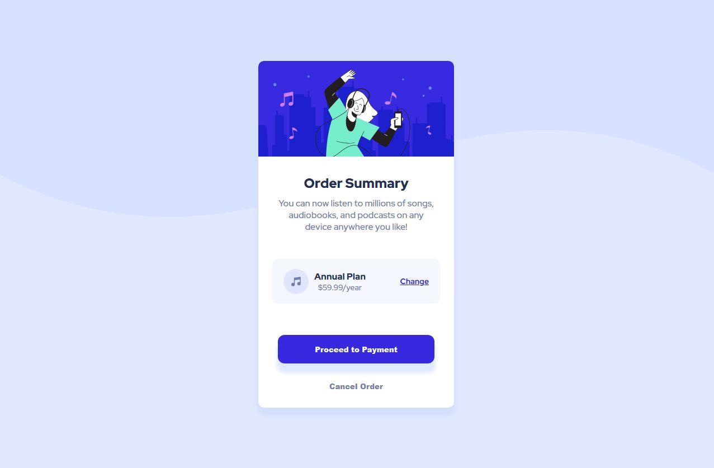

# Frontend Mentor - Order summary card solution

This is a solution to the [Order summary card challenge on Frontend Mentor](https://www.frontendmentor.io/challenges/order-summary-component-QlPmajDUj). Frontend Mentor challenges help you improve your coding skills by building realistic projects. 

## Table of contents

- [Overview](#overview)
  - [The challenge](#the-challenge)
  - [Screenshot](#screenshot)
  - [Links](#links)
- [My process](#my-process)
  - [Built with](#built-with)
  - [What I learned](#what-i-learned)
  - [Continued development](#continued-development)
  - [Useful resources](#useful-resources)
- [Author](#author)

## Overview

### The challenge

Users should be able to:

- See hover states for interactive elements

### Screenshot

### Links

- Solution URL: [GitHub](https://github.com/gmathankumar/OrderSummaryComponent)
- Live Site URL: [Demo](https://gmathankumar.github.io/OrderSummaryComponent/)

## My process

### Built with

- Semantic HTML5 markup
- CSS custom properties
- Flexbox
- CSS Grid

### What I learned

I learned how to set an image as a background,what's the use if 'Box-sizing' and few other CSS tricks.

### Continued development

Would try to use the this order summary component in any of my upcoming projects.

### Useful resources

- [Github Repo](https://github.com/Rysholyn/order-summary-component-last) - This helped me with button and box sizing tricks.

## Author

- SENA Natural Products - (https://senanaturalproducts.in/)
- Frontend Mentor - [@gmathankumar](https://www.frontendmentor.io/profile/gmathankumar)
